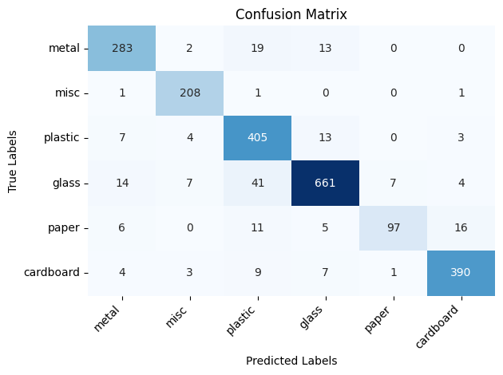

# Waste Sorter

This repository showcases an automatic waste sorting system.

<div align="center">
  
</div>

## About

This was developed as part of an international collaborative initiative between the Lancaster University campuses of Leipzig (Germany) and Bailrigg (England). 

## Resnet50
### Dataset
Custom curated dataset of labeled trash/waste images. These are spread across 6 subfolders (waste types). The dataset can be downloaded [here](https://www.dropbox.com/scl/fi/iqdp1yqlpczd6oyoqu2a8/dataset.zip?rlkey=l1qq1vq9zdma1095nw1boymoc&st=kdaaomas&dl=0).
### Model

Fine-tuned pre-trained ResNet50 architecture. Model weights can be downloaded [here](https://www.dropbox.com/scl/fo/8lik3r8dvd46oc7je5egg/AJz9jQDM7P-uupWw3HokPFw?rlkey=ovap0z4vufqskny28zqy3v89v&st=quylbvca&dl=0).

<div align="center">
  
  <p><em>Confusion matrix of testing set from reduced dataset.</em></p>
</div>

## Dependencies

```
cd waste-sorter
conda env create -f env.yaml
conda activate kuka
```

## HW Specifics

### Raspberry Pi

- Pair (bluetooth) raspberry pi and set to "trusted" on main device.
- Connect servo motor's signal to pin 11 (GPIO 0)

### Claw

- some text

### Kuka Arm

- some text

## Control Flow

```
on start:
    lock lock
    move to detect
    once in detect pos, unlock lock

on video frame -> detect done:
    if locked, continue
    lock lock
    get detect position
    move robot to detect position @ fixed height
    start classify

on classify done:
    move to lower height above obj
    open gripper
    move down
    close gripper
    move up
    move to bin (up)
    move down
    open gripper
    move up
    close gripper
    move to detect
    unlock lock
```

## Credits

- Matias Barandiaran ([m4mbo](https://github.com/m4mbo))
- Parichay Sachdev ([RedHatParichay](https://github.com/RedHatParichay))
- Mustafa Azizi
- Athar Syed
- Osvaldo Catine
- Mikelis Kamepe
- Inderjot Sitt
- Isaac Richardson
